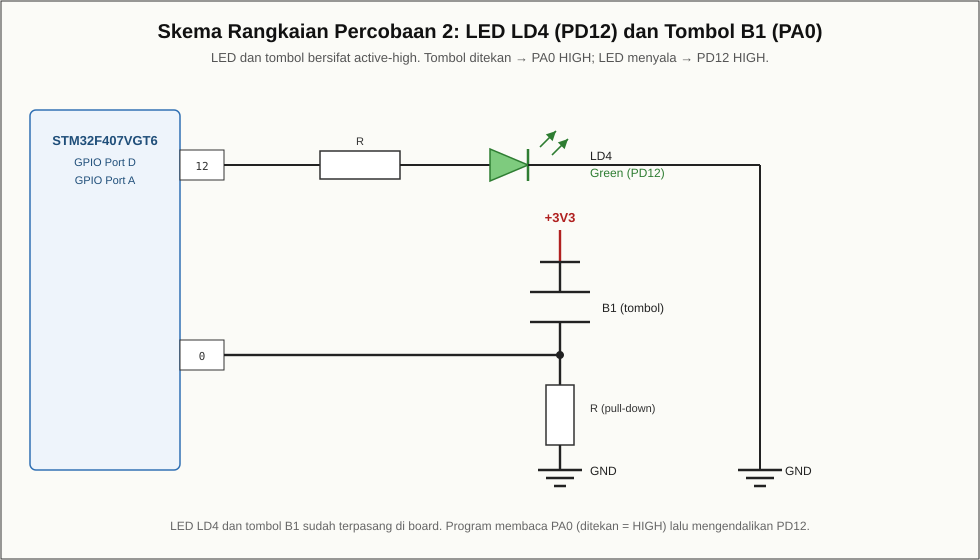

# Modul 02 — Direct IO: Tombol USER (PA0) Mengendalikan LED LD4 (PD12)

## Tujuan

Membaca kondisi tombol pengguna **B1** (terhubung ke pin PA0) dan
menggunakannya untuk menyalakan/mematikan **LED LD4** (terhubung ke pin PD12)
melalui register GPIO secara langsung (*Direct IO*).

## Board target

- Board: **ST STM32F4DISCOVERY**
- ID board PlatformIO: `disco_f407vg`
- Framework: `stm32cube` (header CMSIS `stm32f4xx.h`)

## Kebutuhan perangkat keras

- Board STM32F4Discovery
- Kabel **mini-USB**

## Pin yang dipakai

| Fungsi           | Pin  | Sifat        | Keterangan                     |
|------------------|------|--------------|--------------------------------|
| LED LD4 (hijau)  | PD12 | active-high  | menyala saat HIGH              |
| Tombol B1 (USER) | PA0  | active-high  | bernilai HIGH saat ditekan     |

PA0 dikonfigurasi sebagai masukan (nilai reset `MODER` = 0) dan board sudah
memiliki resistor pull-down, sehingga saat tombol ditekan PA0 bernilai HIGH.

## Wiring

LED dan tombol sudah terpasang di board, sehingga tidak diperlukan rangkaian
tambahan.



## Build dan upload

```bash
pio run
pio run -t upload
```

## Program

`src/main.c` — membaca register `GPIOA->IDR` bit 0; jika HIGH, pin PD12
di-*set* (LED menyala), jika LOW, PD12 di-*reset* (LED mati).

## Hasil yang diharapkan

LED LD4 menyala selama tombol B1 ditekan dan mati ketika tombol dilepas.

## Troubleshooting

- **LED tidak merespons tombol:** pastikan `clock` GPIOA diaktifkan
  (`RCC->AHB1ENR` bit 0) karena register `GPIOA->IDR` dibaca.
- **LED terbalik (nyala saat dilepas):** periksa polaritas; pada board ini
  tombol bersifat active-high (ditekan = HIGH).
- **Upload gagal:** periksa kabel mini-USB dan driver ST-LINK.
