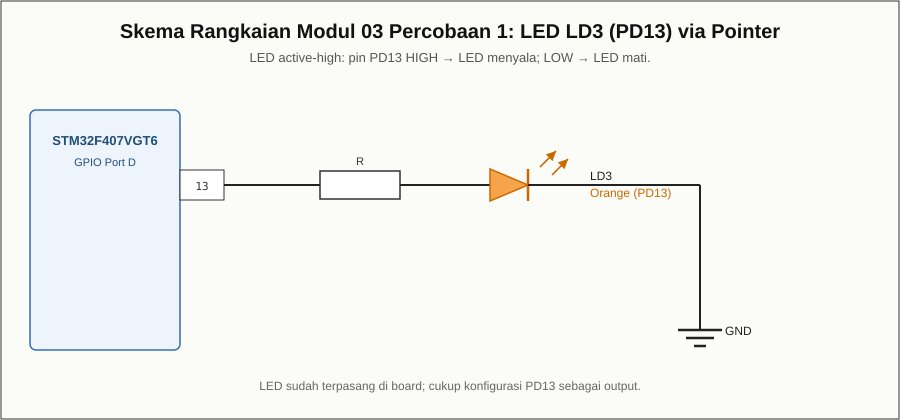

# Modul 03 — Akses I/O melalui Pointer: Blinky LED (PD13)

## Tujuan

Menyalakan dan mematikan **LED LD3** (pin PD13) secara berkedip dengan
mengakses register melalui **pointer/struct** `GPIOD` (dan `RCC`), bukan lagi
alamat absolut seperti pada Modul 02.

## Board target

- Board: **ST STM32F4DISCOVERY**
- ID board PlatformIO: `disco_f407vg`
- Framework: `stm32cube` (header CMSIS `stm32f4xx.h`)

## Kebutuhan perangkat keras

- Board STM32F4Discovery
- Kabel **mini-USB**

## Pin yang dipakai

| Fungsi          | Pin  | Sifat        |
|-----------------|------|--------------|
| LED LD3 (oranye)| PD13 | active-high  |

## Wiring

LED LD3 sudah terpasang di board.



## Build dan upload

```bash
pio run
pio run -t upload
```

## Program

`src/main.c` — mengakses `RCC->AHB1ENR`, `GPIOD->MODER`, dan `GPIOD->BSRR`
melalui pointer/struct. `GPIOD` didefinisikan pada `stm32f4xx.h` sebagai
pointer ke `GPIO_TypeDef`.

## Hasil yang diharapkan

LED LD3 berkedip dengan periode sekitar satu detik.

## Troubleshooting

- **LED tidak berkedip:** pastikan `clock` GPIOD aktif (`RCC->AHB1ENR`) dan
  `MODER` PD13 sudah diatur sebagai output.
- **Kedip tidak tepat 1 detik:** sesuaikan `LOOP_CYCLES`.
- **Upload gagal:** periksa kabel mini-USB dan driver ST-LINK.
