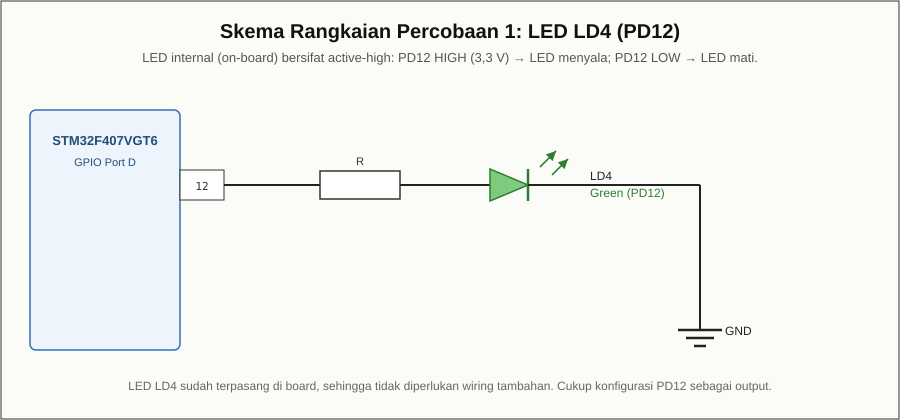

# Modul 04 — Standard Peripheral Library (Legacy): Output LED (PD12)

## Tujuan

Membuat LED LD4 (PD12) berkedip menggunakan **Standard Peripheral Library (SPL)**,
untuk memahami posisi SPL dibandingkan akses register langsung dan HAL.

## Board target

- Board: **ST STM32F4DISCOVERY**
- ID board PlatformIO: `disco_f407vg`
- Framework: **`spl`** (materi legacy)

## Kebutuhan perangkat keras

- Board STM32F4Discovery
- Kabel **mini-USB**

## Pin yang dipakai

| Fungsi          | Pin  | Sifat       |
|-----------------|------|-------------|
| LED LD4 (hijau) | PD12 | active-high |

## Wiring

LED LD4 sudah terpasang di board.



## Build dan upload

```bash
pio run
pio run -t upload
```

> Perhatikan: `platformio.ini` memakai `framework = spl`, bukan `stm32cube`.

## Program

`src/main.c` memakai `RCC_AHB1PeriphClockCmd()`, `GPIO_Init()`,
`GPIO_SetBits()`, dan `GPIO_ResetBits()` dari SPL.

## Hasil yang diharapkan

LED LD4 berkedip (nyala/mati bergantian).

## Troubleshooting

- **Fungsi SPL tidak dikenali:** pastikan `framework = spl` pada
  `platformio.ini`.
- **Upload gagal:** periksa kabel mini-USB dan driver ST-LINK.
