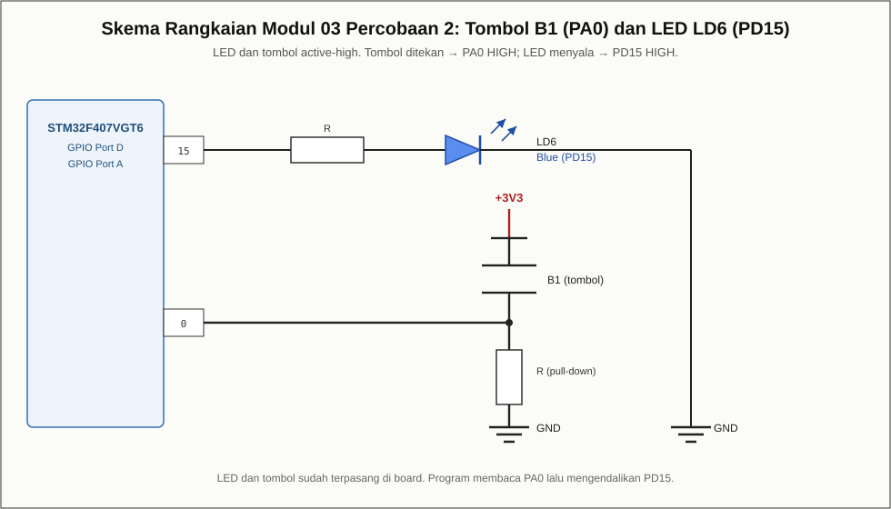

# Modul 04 — Standard Peripheral Library (Legacy): Input Tombol (PA0) → LED (PD15)

## Tujuan

Membaca tombol B1 (PA0) dan mengendalikan LED LD6 (PD15) menggunakan **SPL**.

## Board target

- Board: **ST STM32F4DISCOVERY**
- ID board PlatformIO: `disco_f407vg`
- Framework: **`spl`** (materi legacy)

## Kebutuhan perangkat keras

- Board STM32F4Discovery
- Kabel **mini-USB**

## Pin yang dipakai

| Fungsi         | Pin  | Sifat       |
|----------------|------|-------------|
| LED LD6 (biru) | PD15 | active-high |
| Tombol B1      | PA0  | active-high |

## Wiring

LED dan tombol sudah terpasang di board.



## Build dan upload

```bash
pio run
pio run -t upload
```

## Program

`src/main.c` memakai `GPIO_ReadInputDataBit()` untuk membaca PA0 dan
`GPIO_SetBits()`/`GPIO_ResetBits()` untuk PD15.

## Hasil yang diharapkan

LED LD6 menyala selama tombol B1 ditekan dan mati saat dilepas.

## Troubleshooting

- **LED tidak merespons:** pastikan clock GPIOA dan GPIOD diaktifkan.
- **Upload gagal:** periksa kabel mini-USB dan driver ST-LINK.
