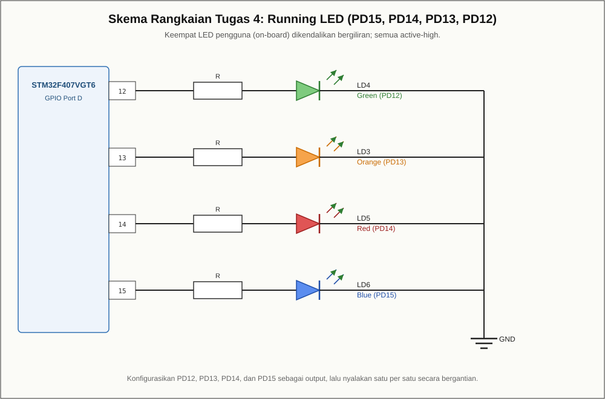

# Modul 05 — SysTick: Delay Berbasis SysTick

## Tujuan

Membuat fungsi `delay_ms()` berbasis SysTick, lalu memakainya untuk mengedipkan
LED.

## Board target

- Board: **ST STM32F4DISCOVERY** (`disco_f407vg`)
- Framework: `stm32cube` (CMSIS)

## Pin yang dipakai

| Fungsi | Pin |
|---|---|
| LED LD4–LD6 | PD12–PD15 |

## Wiring

LED sudah terpasang di board.



## Build dan upload

```bash
pio run
pio run -t upload
```

## Program

`src/main.c` menyalakan SysTick 1 ms, lalu `delay_ms()` menunggu sampai
penghitung habis. Loop utama membalik LED setiap 10 ms.

## Hasil yang diharapkan

LED berkedip dengan periode yang ditentukan `delay_ms()`.

## Troubleshooting

- **Delay tidak sesuai:** periksa nilai `SystemCoreClock` dan pembagi pada
  `SysTick_Config()`.
- **Upload gagal:** periksa kabel mini-USB dan driver ST-LINK.
